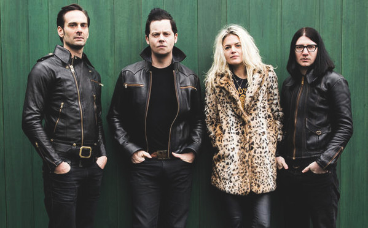

# The Dead Weather

## Artist Profile

"The Dead Weather" didn't actually form, but more or less coalesced as a result of the creative directions in which each of its members were moving by late in 2008. From an impromptu jam, in early January 2009 at Jack White's Third Man studio in Nashville, the foursome found common ground and began writing, composing and laying down recordings 'on the fly'. The outcome was the band "The Dead Weather " and the album "Horehound", representing one of the brightest and most refreshing events in the musical history of 2009.

Alison 'VV' Mosshart, [ex "Discount"] and still part of "The Kills" duo, provides lead vocals, backing guitar, percussion and her compositional style and delivery to many of the band's lyrics,

Dean Fertita, [ex "Waxwings" and "Queens Of The Stone Age"] brings his multi-instrumentalist skills to bear on guitar, bass, organ, piano, synth and backing vocals.

Jack Lawrence, [ex "Do-Whaters" and 'floating' member of "The Greenhornes", "Blanche" and "The Raconteurs"] provides bass, guitar, drums and backing vocals.

Jack White, aka Jack White III, ["The White Stripes" & "The Raconteurs"] plays drums, provides lead and backing vocals, and plays his unmistakable style of lead guitar. Born "John Gillis", White began work in the upholstery trade, forming his first two-piece band "Two Part Resin", later renamed "The Upholsterers" after a career he would leave behind. He was then a member of "Goober & The Peas", Two-Star Tabernacle" and "The Henchmen" before morphing into the persona of Jack White of "The White Stripes". After the success of "The White Stripes" as a 2-piece, with his wife Meg on drums [who's surname he adopted], White was hailed by Rolling Stone magazine as 17th in their list of "Greatest Guitarists Of All Time".

"The Dead Weather" band debut was a performance at "Third Man" HQ in Nashville on the 11th March 2009, followed by the single "Hang You From The Heavens" released from the "Horehound" album. The album was released on 13th July 2009 in Europe and the following day in North America, with 3 tracks made available as downloads for the "Rock Band" video game. The 3 tracks were "Hang You From The Heavens", "No Hassle Night" and "Treat Me Like Your Mother". In October 2009 the band released a further single "I Cut Like A Buffalo", accompanied by a cover of The West Coast Pop Art Experimental Band song "A Child Of A Few Hours Is Burning To Death". The single was also available bundled with 2 live tracks "Bone House" & "Hang You From The Heavens". During 2009 the band appeared on "The Culture Show" & "Later, With Jools Holland" on UK TV.

At the close of 2009 the band were close to completion of a follow-up album and will be touring the Pacific in March 2010, taking in Australia, New Zealand & Japan. By mid-January 2010 a documentary DVD will be available worldwide titled "It Might Get Loud" featuring the guitarists Jack White ["Fly Farm Blues"], Jimmy Page & The Edge.

## Artist Links

- [https://thirdmanstore.com/collections/the-dead-weather](https://thirdmanstore.com/collections/the-dead-weather)
- [https://myspace.com/thedeadweather](https://myspace.com/thedeadweather)
- [https://www.facebook.com/Dead.Weather/](https://www.facebook.com/Dead.Weather/)
- [https://www.youtube.com/thedeadweathertv](https://www.youtube.com/thedeadweathertv)

## See also

- [Buzzkill(er) / It's Just Too Bad](Buzzkiller_-_Its_Just_Too_Bad.md)
