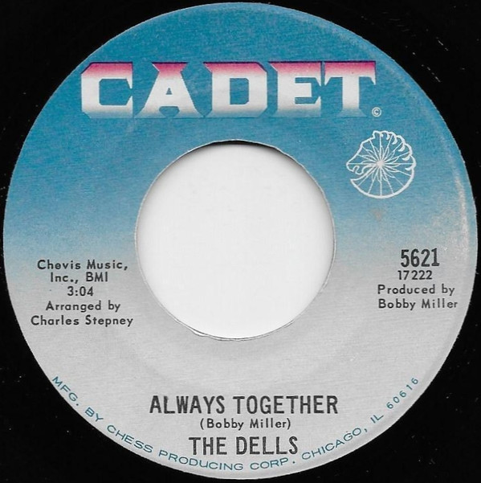

# Always Together

By The Dells

## Album Data

[Discogs URL](https://www.discogs.com/release/2123540-The-Dells-Always-Together)

- Label: Cadet
- Formats: Vinyl, 7", 45 RPM
- Genres: Funk / Soul, Soul, Funk
- Rating: 4.21
- Released: 1968
- Year: 1968
- Release ID: 2123540
- Media condition: 
- Sleeve condition: 
- Speed: 
- Weight: 
- Notes: 

## Album Tracks

| **Position** | **Title** | **Duration** |
|--------------|-----------|--------------|
| A | **Always Together** | 3:04 |
| B | **I Want My Momma** | 2:29 |

## Artist Roles

| **Name** | **Role** |
|----------|----------|
| **Charles Stepney** | Arranged By |
| **Bobby Miller** | Producer [Produced By], Written-By |

