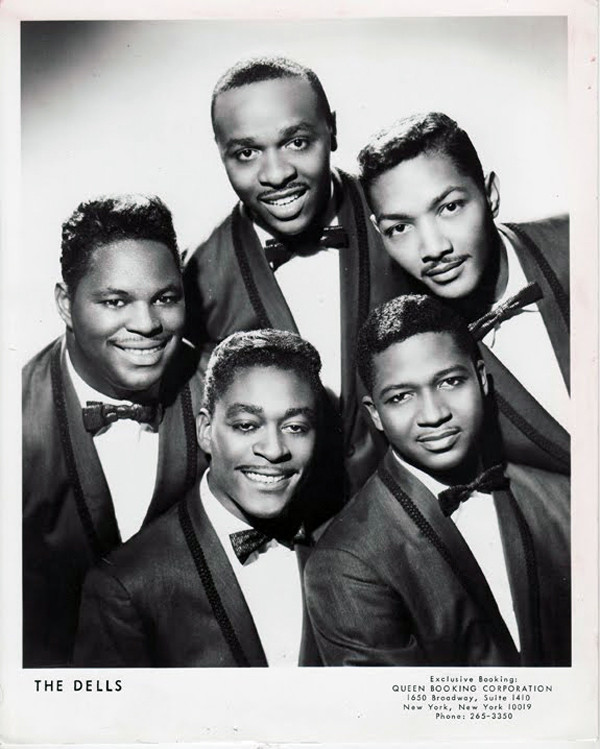

# The Dells

## Artist Profile

Soul - doo-wop - funk - disco male vocal group

Formed in 1952, Harvey, Illinois. U.S.
Their career spanned more than four decades.
Their vocal leaders were the falsetto singer Johnny Carter and baritone singer Marvin Junior.
Initially they were called The El-Rays
Their first hit was in 1956, "Oh What A Night" at Vee Jay Records.
Late 50's they had some line-up exchanges with the doo-wop vocal groups The Moonglows and The Flamingos.
After two albums at Vee Jay Records they were signed at Cadet in mid 60's where they released a dozen albums until 1975.
After Cadet they released eight more albums at various labels like Mercury, ABC Records, 20th Century Fox Records, Private I Records, Veteran Records, Philadelphia International Records, Volt and Devine Records up until 2002.
Inducted into Rock And Roll Hall of Fame in 2004 (Performer).

## Artist Links

- [http://en.wikipedia.org/wiki/The_Dells](http://en.wikipedia.org/wiki/The_Dells)
- [http://www.whosampled.com/The-Dells/](http://www.whosampled.com/The-Dells/)

## See also

- [Always Together](Always_Together.md)
