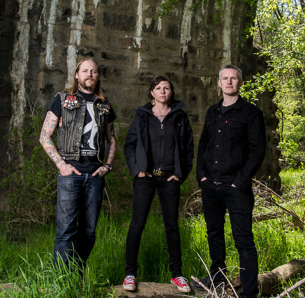

# The Devil Makes Three

## Artist Profile

Three-piece bluegrass folk punk band from Santa Cruz, California. Formed in 2002.

Members: Pete Bernhard (guitar), Lucia Turino (upright bass), Cooper McBean (guitar/tenor banjo).

## Artist Links

- [http://www.thedevilmakesthree.com/](http://www.thedevilmakesthree.com/)
- [https://thedevilmakesthree.bandcamp.com/](https://thedevilmakesthree.bandcamp.com/)
- [https://www.facebook.com/thedevilmakesthreemusic](https://www.facebook.com/thedevilmakesthreemusic)
- [https://www.youtube.com/user/DM3The](https://www.youtube.com/user/DM3The)
- [https://twitter.com/thedevilmakes3](https://twitter.com/thedevilmakes3)
- [https://www.instagram.com/thedevilmakes3/](https://www.instagram.com/thedevilmakes3/)
- [https://en.wikipedia.org/wiki/The_Devil_Makes_Three_(band)](https://en.wikipedia.org/wiki/The_Devil_Makes_Three_(band))

## See also

- [The Devil Makes Three](The_Devil_Makes_Three.md)
