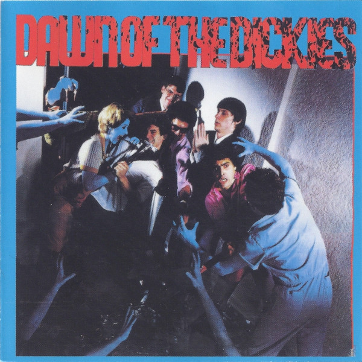

# Dawn Of The Dickies

By The Dickies

## Album Data

[Discogs URL](https://www.discogs.com/release/1734394-The-Dickies-Dawn-Of-The-Dickies)

- Label: A&M Records
- Formats: Vinyl, LP, Album
- Genres: Rock, Hard Rock, Punk
- Rating: 4.25
- Released: 1979-11-09
- Year: 1979
- Release ID: 1734394
- Media condition: 
- Sleeve condition: 
- Speed: 
- Weight: 
- Notes: 

## Album Tracks

| **Position** | **Title** | **Duration** |
|--------------|-----------|--------------|
| A1 | **Where Did His Eye Go?** | 3:40 |
| A2 | **Fan Mail** | 3:05 |
| A3 | **Manny, Moe And Jack** | 2:50 |
| A4 | **Infidel Zombie** | 3:03 |
| A5 | **I'm A Chollo** | 3:45 |
| B1 | **Nights In White Satin** | 2:54 |
| B2 | **(I'm Stuck In A Pagoda With) Tricia Toyota** | 2:53 |
| B3 | **I've Got A Splitting Hedachi** | 2:28 |
| B4 | **Attack Of The Mole Men** | 3:40 |
| B5 | **She Loves Me Not** | 1:12 |

## Artist Roles

| **Name** | **Role** |
|----------|----------|
| **Billy Club** | Bass, Vocals |
| **Artrouble** | Cover [Album] |
| **Karlos Kaballero** | Drums, Percussion |
| **Stan Lee** | Guitar, Vibraslap, Vocals |
| **Chuck Wagon** | Keyboards, Guitar, Saxophone, Harmonica, Synthesizer, Percussion, Vocals |
| **Leonard Graves Phillips** | Lead Vocals, Mellotron, Piano, Organ |
| **John Hewlett** | Management |
| **Robin Geoffrey Cable** | Producer, Engineer |

