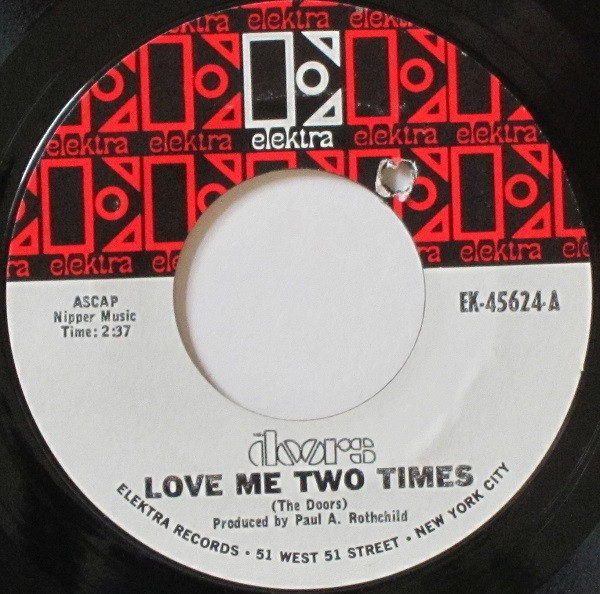

# Love Me Two Times

By The Doors

## Album Data

[Discogs URL](https://www.discogs.com/release/4411429-The-Doors-Love-Me-Two-Times)

- Label: Elektra
- Formats: Vinyl, 7", 45 RPM, Single
- Genres: Rock, Classic Rock
- Rating: 4.42
- Released: 1967
- Year: 1967
- Release ID: 4411429
- Media condition: 
- Sleeve condition: 
- Speed: 
- Weight: 
- Notes: 

## Album Tracks

| **Position** | **Title** | **Duration** |
|--------------|-----------|--------------|
| A | **Love Me Two Times** | 2:37 |
| B | **Moonlight Drive** | 2:16 |

## Artist Roles

| **Name** | **Role** |
|----------|----------|
| **Paul A. Rothchild** | Producer |
| **The Doors** | Written-By |

