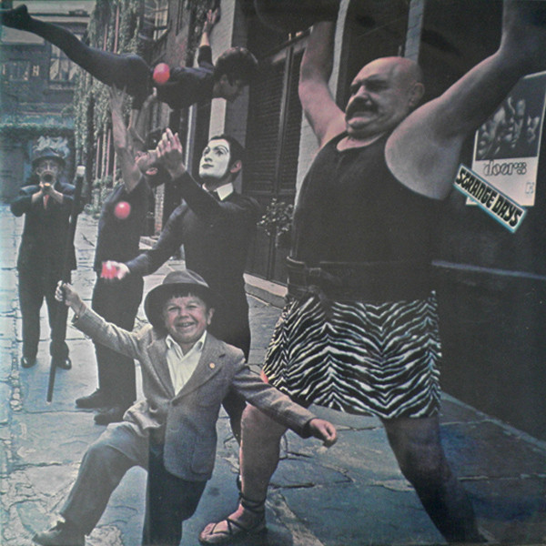

# Strange Days

By The Doors

## Album Data

[Discogs URL](https://www.discogs.com/release/2030783-The-Doors-Strange-Days)

- Label: Elektra
Rhino Records (2)
Rhino Records (2)
- Formats: Vinyl, LP, Album, Reissue, Stereo
- Genres: Rock, Psychedelic Rock, Classic Rock
- Rating: 4.48
- Released: 2009-09-14
- Year: 1967
- Release ID: 2030783
- Media condition: 
- Sleeve condition: 
- Speed: 
- Weight: 
- Notes: 

## Album Tracks

| **Position** | **Title** | **Duration** |
|--------------|-----------|--------------|
| A1 | **Strange Days** | 3:05 |
| A2 | **You're Lost Little Girl** | 3:01 |
| A3 | **Love Me Two Times** | 3:23 |
| A4 | **Unhappy Girl** | 2:00 |
| A5 | **Horse Latitudes** | 1:30 |
| A6 | **Moonlight Drive** | 3:00 |
| B1 | **People Are Strange** | 2:10 |
| B2 | **My Eyes Have Seen You** | 2:22 |
| B3 | **I Can't See Your Face In My Mind** | 3:18 |
| B4 | **When The Music's Over** | 11:00 |

## Artist Roles

| **Name** | **Role** |
|----------|----------|
| **Doug Lubahn** | Bass |
| **William S. Harvey** | Cover [Concept], Art Direction |
| **John Densmore** | Drums |
| **Bruce Botnick** | Engineer [Audio Engineering] |
| **Robby Krieger** | Guitar |
| **Ray Manzarek** | Keyboards, Marimba |
| **Bernie Grundman** | Lacquer Cut By |
| **Joel Brodsky** | Photography By [Cover Photography] |
| **Paul A. Rothchild** | Producer |
| **Jac Holzman** | Supervised By [Production Supervisor] |
| **Jim Morrison** | Vocals |
| **The Doors** | Words By, Music By |
| **The Doors** | Written-By, Arranged By, Performer |

