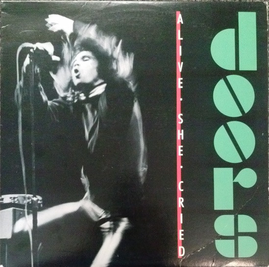

# Alive, She Cried

By The Doors

## Album Data

[Discogs URL](https://www.discogs.com/release/5310626-Doors-Alive-She-Cried)

- Label: Elektra
Elektra
- Formats: Vinyl, LP, Album
- Genres: Rock, Psychedelic Rock, Blues Rock, Arena Rock
- Rating: 4.24
- Released: 1983-10-00
- Year: 1983
- Release ID: 5310626
- Media condition: 
- Sleeve condition: 
- Speed: 
- Weight: 
- Notes: 

## Album Tracks

| **Position** | **Title** | **Duration** |
|--------------|-----------|--------------|
| A1 | **Gloria** | 6:17 |
| A2 | **Light My Fire (Incl. Graveyard Poem)** | 9:51 |
| A3 | **You Make Me Real** | 3:06 |
| B1 | **Texas Radio & The Big Beat** | 1:52 |
| B2 | **Love Me Two Times** | 3:17 |
| B3 | **Little Red Rooster** | 7:05 |
| B4 | **Moonlight Drive (Including Horse Latitudes)** | 5:34 |

## Artist Roles

| **Name** | **Role** |
|----------|----------|
| **The Doors** | Artwork [Concept] |
| **Jeff Lancaster** | Design |
| **John Densmore** | Drums |
| **Robby Krieger** | Guitar |
| **John Sebastian** | Harmonica |
| **Ben Edmonds** | Liner Notes |
| **Bernie Grundman** | Mastered By |
| **Bill Gazecki** | Mixed By |
| **Rick Hart** | Mixed By |
| **Ray Manzarek** | Organ, Bass |
| **Jim Marshall (3)** | Photography By [Back Cover] |
| **Peter Polymenakos** | Photography By [Back Cover] |
| **Yale Joel** | Photography By [Fillmore East] |
| **David Sygall** | Photography By [Front Cover] |
| **Henry Diltz** | Photography By [Hollywood Bowl] |
| **Paul A. Rothchild** | Producer |
| **Bruce Botnick** | Recorded By [Live] |
| **Jim Morrison** | Vocals |
| **The Doors** | Written-By |
| **Van Morrison** | Written-By |
| **Willie Dixon** | Written-By |

