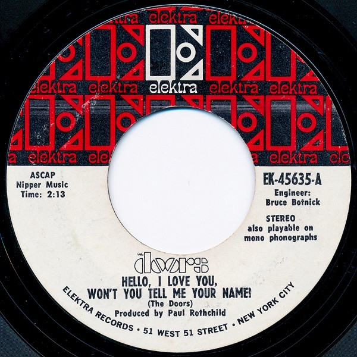

# Hello, I Love You, Won't You Tell Me Your Name?

By The Doors

## Album Data

[Discogs URL](https://www.discogs.com/release/2919530-The-Doors-Hello-I-Love-You-Wont-You-Tell-Me-Your-Name)

- Label: Elektra
- Formats: Vinyl, 7", 45 RPM, Styrene, Stereo
- Genres: Rock, Psychedelic Rock
- Rating: 4.31
- Released: 1968
- Year: 1968
- Release ID: 2919530
- Media condition: 
- Sleeve condition: 
- Speed: 
- Weight: 
- Notes: 

## Album Tracks

| **Position** | **Title** | **Duration** |
|--------------|-----------|--------------|
| A | **Hello, I Love You, Won't You Tell Me Your Name?** | 2:13 |
| B | **Love Street** | 2:50 |

## Artist Roles

| **Name** | **Role** |
|----------|----------|
| **Bruce Botnick** | Engineer |
| **Paul A. Rothchild** | Producer |
| **The Doors** | Written-By |

