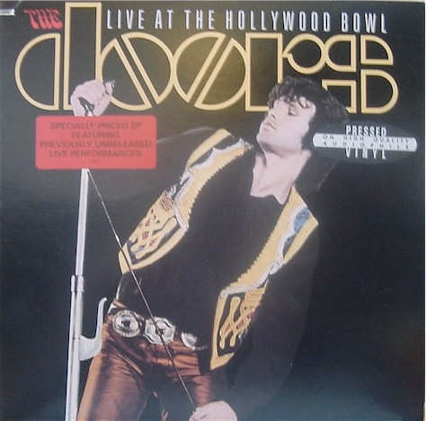

# Live At The Hollywood Bowl

By The Doors

## Album Data

[Discogs URL](https://www.discogs.com/release/2139821-The-Doors-Live-At-The-Hollywood-Bowl)

- Label: Elektra
Elektra
- Formats: Vinyl, LP, EP, Promo
- Genres: Rock
- Rating: 4
- Released: 1988
- Year: 1987
- Release ID: 2139821
- Media condition: 
- Sleeve condition: 
- Speed: 
- Weight: 
- Notes: 

## Album Tracks

| **Position** | **Title** | **Duration** |
|--------------|-----------|--------------|
| A1 | **Wake Up** | 1:40 |
| A2 | **Light  My Fire** | 8:15 |
| B1 | **Unknown Soldier** | 4:14 |
| B2 | **A Little Game** | 1:20 |
| B3 | **The Hill Dwellers** | 2:21 |
| B4 | **Spanish Caravan** | 1:19 |

## Artist Roles

| **Name** | **Role** |
|----------|----------|
| **Curtice Taylor** | Artwork [Colorization] |
| **Carol Bobolts** | Design |
| **John Densmore** | Drums |
| **Bruce Botnick** | Engineer |
| **Robby Krieger** | Guitar |
| **Ray Manzarek** | Keyboards |
| **Henry Diltz** | Photography By |
| **Paul A. Rothchild** | Producer |
| **Jim Morrison** | Vocals |
| **The Doors** | Written-By |

