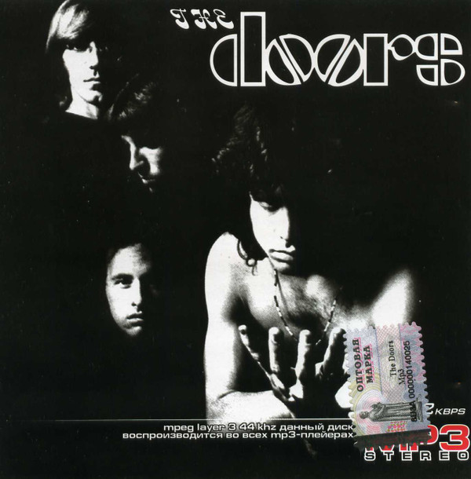

# The Doors

By The Doors

## Album Data

[Discogs URL](https://www.discogs.com/release/2441353-The-Doors-The-Doors)

- Label: Elektra
Rhino Records (2)
Rhino Vinyl
- Formats: Vinyl, LP, Album, Reissue, Stereo
- Genres: Rock, Psychedelic Rock, Classic Rock
- Rating: 4.73
- Released: 2009-09-14
- Year: 1967
- Release ID: 2441353
- Media condition: 
- Sleeve condition: 
- Speed: 
- Weight: 
- Notes: 

## Album Tracks

| **Position** | **Title** | **Duration** |
|--------------|-----------|--------------|
| A1 | **Break On Through (To The Other Side)** | 2:25 |
| A2 | **Soul Kitchen** | 3:30 |
| A3 | **The Crystal Ship** | 2:30 |
| A4 | **Twentieth Century Fox** | 2:30 |
| A5 | **Alabama Song (Whisky Bar)** | 3:15 |
| A6 | **Light My Fire** | 6:50 |
| B1 | **Back Door Man** | 3:30 |
| B2 | **I Looked At You** | 2:18 |
| B3 | **End Of The Night** | 2:49 |
| B4 | **Take It As It Comes** | 2:13 |
| B5 | **The End** | 11:35 |

## Artist Roles

| **Name** | **Role** |
|----------|----------|
| **William S. Harvey** | Art Direction, Design |
| **John Densmore** | Drums |
| **Bruce Botnick** | Engineer |
| **Robby Krieger** | Guitar |
| **Bernie Grundman** | Lacquer Cut By |
| **Ray Manzarek** | Organ, Piano, Bass |
| **Joel Brodsky** | Photography By [Back Cover Photo] |
| **Guy Webster** | Photography By [Front Cover Photo] |
| **Paul A. Rothchild** | Producer |
| **Jac Holzman** | Supervised By [Production Supervisor] |
| **Jim Morrison** | Vocals |
| **The Doors** | Words By, Music By |

