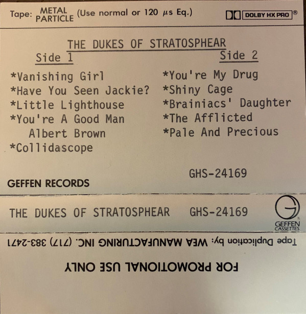

# Psonic Psunspot

By The Dukes Of Stratosphear

## Album Data

[Discogs URL](https://www.discogs.com/release/391154-The-Dukes-Of-Stratosphear-Psonic-Psunspot)

- Label: Geffen Records
- Formats: Vinyl, LP, Album
- Genres: Rock, Garage Rock, Psychedelic Rock
- Rating: 4.39
- Released: 1987
- Year: 1987
- Release ID: 391154
- Media condition: 
- Sleeve condition: 
- Speed: 
- Weight: 
- Notes: 

## Album Tracks

| **Position** | **Title** | **Duration** |
|--------------|-----------|--------------|
| A1 | **Vanishing Girl** | 2:30 |
| A2 | **Have You Seen Jackie?** | 3:45 |
| A3 | **Little Lighthouse** | 4:36 |
| A4 | **You're A Good Man Albert Brown (Curse You Red Barrel)** | 3:40 |
| A5 | **Collideascope** | 3:21 |
| B1 | **You're My Drug** | 3:16 |
| B2 | **Shiny Cage** | 3:15 |
| B3 | **Brainiac's Daughter** | 3:58 |
| B4 | **The Affiliated** | 2:17 |
| B5 | **Pale And Precious** | 5:05 |

## Artist Roles

| **Name** | **Role** |
|----------|----------|
| **John Leckie** | Producer |
| **The Dukes Of Stratosphear** | Producer |
| **Sir John Johns** | Written-By |
| **The Red Curtain** | Written-By |

