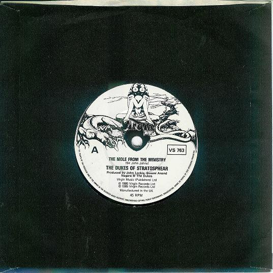

# The Mole From The Ministry

By The Dukes Of Stratosphear

## Album Data

[Discogs URL](https://www.discogs.com/release/1354981-The-Dukes-Of-Stratosphear-The-Mole-From-The-Ministry)

- Label: Virgin
- Formats: Vinyl, 7", Single
- Genres: Rock, Psychedelic Rock
- Rating: 4.56
- Released: 1985
- Year: 1985
- Release ID: 1354981
- Media condition: 
- Sleeve condition: 
- Speed: 
- Weight: 
- Notes: 

## Album Tracks

| **Position** | **Title** | **Duration** |
|--------------|-----------|--------------|
| A | **The Mole From The Ministry** | 4:14 |
| B | **My Love Explodes** | 3:49 |

## Artist Roles

| **Name** | **Role** |
|----------|----------|
| **John Leckie** | Producer |
| **Swami Anand Nagara** | Producer |
| **The Dukes Of Stratosphear** | Producer |
| **Sir John Johns** | Written-By |

