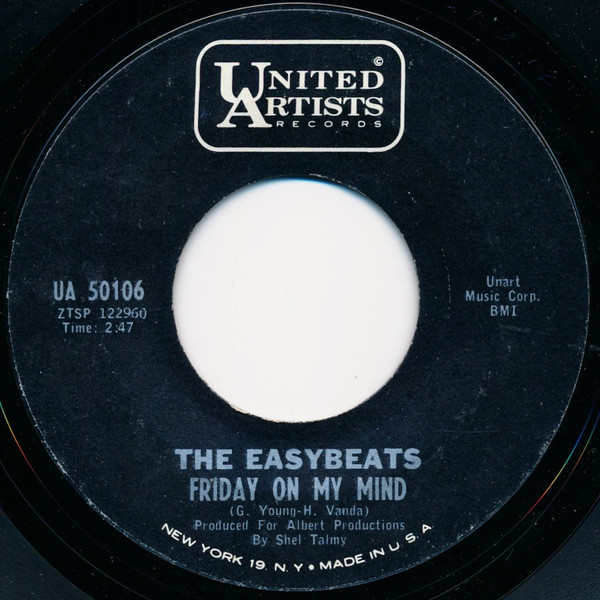

# Friday On My Mind

By The Easybeats

## Album Data

[Discogs URL](https://www.discogs.com/release/1332347-The-Easybeats-Friday-On-My-Mind)

- Label: United Artists Records
- Formats: Vinyl, 7", 45 RPM, Single, Styrene
- Genres: Rock, Pop Rock, Beat
- Rating: 4.15
- Released: 1966
- Year: 1966
- Release ID: 1332347
- Media condition: 
- Sleeve condition: 
- Speed: 
- Weight: 
- Notes: 

## Album Tracks

| **Position** | **Title** | **Duration** |
|--------------|-----------|--------------|
| A | **Friday On My Mind** | 2:47 |
| B | **Made My Bed: Gonna Lie In It** | 2:20 |

## Artist Roles

| **Name** | **Role** |
|----------|----------|
| **Shel Talmy** | Producer |

