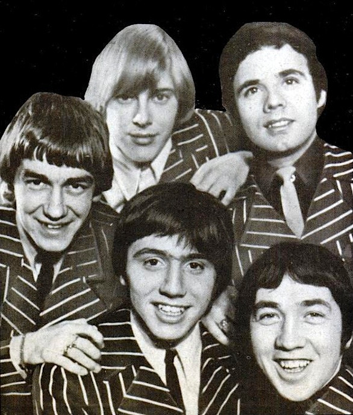

# The Easybeats

## Artist Profile

Australian rock and roll band, formed in Sydney in late 1964, relocated to London, England, in late 1966. They disbanded at the end of 1969. In 1986 they reunited for a national reunion tour.

## Artist Links

- [https://en.wikipedia.org/wiki/The_Easybeats](https://en.wikipedia.org/wiki/The_Easybeats)
- [http://www.milesago.com/artists/easybeats.htm](http://www.milesago.com/artists/easybeats.htm)

## See also

- [Friday On My Mind](Friday_On_My_Mind.md)
