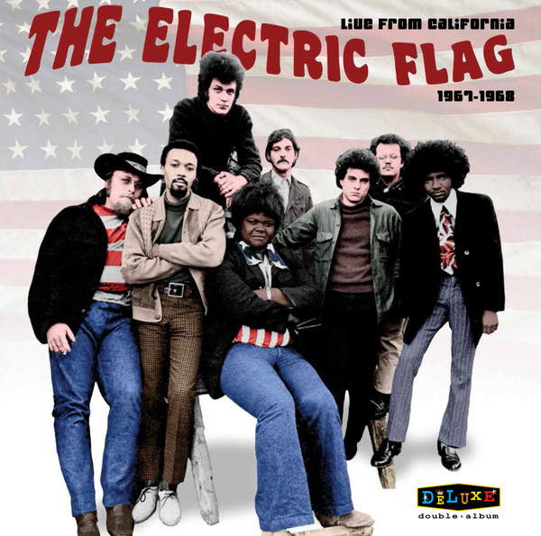

# Live From California 1967-1968

By The Electric Flag

## Album Data

[Discogs URL](https://www.discogs.com/release/10176903-The-Electric-Flag-Live-From-California-1967-1968)

- Label: RockBeat Records
- Formats: Vinyl, LP, Album
- Genres: Rock, Funk / Soul, Blues
- Rating: 3.86
- Released: 2017-04-22
- Year: 2017
- Release ID: 10176903
- Media condition: 
- Sleeve condition: 
- Speed: 
- Weight: 
- Notes: 

## Album Tracks

| **Position** | **Title** | **Duration** |
|--------------|-----------|--------------|
| A1 | **Spotlight** | 3:43 |
| A2 | **I Was Robbed Last Night** | 4:39 |
| A3 | **I Found Out** | 3:08 |
| A4 | **Never Be Lonely Again** | 3:32 |
| A5 | **Losing Game** | 3:17 |
| B1 | **My Baby Wants To Test Me** | 8:18 |
| B2 | **I Should Have Left Her** | 4:09 |
| B3 | **You Don't Realize** | 5:11 |
| B4 | **Groovin' Is Easy** | 4:22 |
| C1 | **Soul Searchin'** | 8:15 |
| C2 | **Tuning** | 2:09 |
| C3 | **Milk Cow Blues** | 5:00 |
| C4 | **Tuning** | 0:51 |
| C5 | **Groovin' Is Easy** | 4:29 |
| D1 | **I'd Rather Drink Muddy Water** | 8:01 |
| D2 | **Hey Joe** | 5:11 |
| D3 | **I've Been Loving You Too Long** | 6:29 |

## Artist Roles

| **Name** | **Role** |
|----------|----------|
| **Mark Kalmus** | Art Direction, Design |
| **Herbie Rich** | Baritone Saxophone |
| **Harvey Brooks** | Bass Guitar |
| **Buddy Miles** | Drums, Vocals |
| **Mike Bloomfield** | Guitar |
| **Barry Goldberg** | Keyboards |
| **Randy Perry** | Mastered By |
| **David Skye** | Producer |
| **Peter Strazza** | Tenor Saxophone |
| **Marcus Doubleday** | Trumpet, Flugelhorn |
| **Nick Gravenites** | Vocals |

