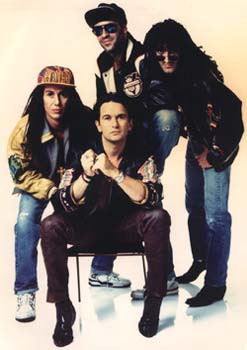

# The Escape Club

## Artist Profile

The band formed in 1983, comprising Mad Shadows members lead singer/rhythm guitarist Trevor Steel and guitarist John Holliday, along with former Expressos members bassist Johnnie Christo (a.k.a. John Christoforou) and drummer Milan Zekavica. 

The seeds for the formation of The Escape Club were sown when Zekavica joined Steel and Holliday in Mad Shadows, who subsequently performed on an album by the obscure early 1980s Stephen Milford-fronted new wave outfit Planning by Numbers.

Before long, Christo had also joined the lineup, and The Escape Club was born and the fledgling band quickly released the single "Breathing".

In 1985 The Escape Club signed with EMI and recorded the album White Fields, which was released the following year. 

In 1987, the group moved to Atlantic Records and began recording their next album, Wild Wild West, and the album was released in the summer of 1988 and spawned the single "Wild, Wild West", which climbed to No. 1 on the Billboard Hot 100 chart while the song's video received major rotation on MTV, however, it was banned from British Television for unclear reasons.

In 1989, they released two more singles from Wild Wild West: "Shake for the Sheik", which climbed to No. 28, and "Walking Through Walls", which peaked at No. 81.

The Escape Club's cover single of The Doors' "20th Century Fox" appeared on The Wonder Years: Music From the Emmy Award-Winning Show & Its Era, which also received airplay on MTV. The song was produced by Doors band member Ray Manzarek.

In 1990 the band returned to the studio to record their final album, Dollars and Sex, which saw a March 1991 release. The first single, "Call It Poison", failed to crack the US Top 40. 

Atlantic Records then released the song "I'll Be There", which the group said was heavily influenced by the death of a friend's wife, and the song has become an anthem among those who have experienced losses of their own. 

"I'll Be There" reached No. 8 on the Billboard Hot 100 and achieved gold status in the US.The group disbanded in 1992. 

The Escape Club is the only British band to have a No. 1 hit in the U.S. while not charting at all in their native UK.

The band self-released a fourth album "Cloud 10" in 2005.

Trevor Steel and John Holliday reunited, with new band member Red Broad, in 2009 and self-released a fifth studio album, Celebrity, in February 2012.

In 2019, Johnnie Christo returned to the line-up and the Escape Club played as a full band for the first time in 25 years during the U.S. tour Lost 80s Live. 

## Artist Links

- [https://theescapeclubband.com/](https://theescapeclubband.com/)
- [https://www.facebook.com/theescapeclub](https://www.facebook.com/theescapeclub)
- [https://www.instagram.com/theescapeclubband/](https://www.instagram.com/theescapeclubband/)
- [https://twitter.com/TheEscapeClub](https://twitter.com/TheEscapeClub)
- [https://www.youtube.com/TheEscapeClub](https://www.youtube.com/TheEscapeClub)
- [https://en.wikipedia.org/wiki/The_Escape_Club](https://en.wikipedia.org/wiki/The_Escape_Club)

## See also

- [Wild, Wild West](Wild__Wild_West.md)
