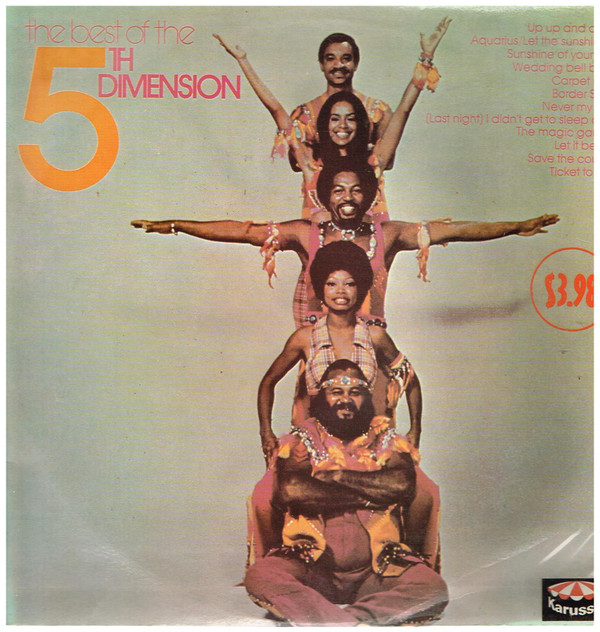

# The Best Of The 5th Dimension

By The Fifth Dimension

## Album Data

[Discogs URL](https://www.discogs.com/release/4470286-The-5th-Dimension-The-Best-Of-The-5th-Dimension)

- Label: Kory Records
- Formats: Vinyl, LP, Compilation
- Genres: Funk / Soul, Soul
- Rating: 3.89
- Released: 1976
- Year: 1976
- Release ID: 4470286
- Media condition: 
- Sleeve condition: 
- Speed: 
- Weight: 
- Notes: 

## Album Tracks

| **Position** | **Title** | **Duration** |
|--------------|-----------|--------------|
| A1 | **(Last Night) I Didn't Get To Sleep At All** | 3:12 |
| A2 | **Stoned Soul Picnic** | 3:23 |
| A3 | **Medley: Aquarius/Let The Sunshine In (The Flesh Failures)** | 4:49 |
| A4 | **Sweet Blindness** | 3:24 |
| A5 | **California Soul** | 3:16 |
| B1 | **Save The Country** | 2:39 |
| B2 | **Up, Up And Away** | 2:40 |
| B3 | **Together Let's Find Love** | 3:00 |
| B4 | **Let It Be Me** | 2:20 |
| B5 | **Those Were The Days** | 3:04 |

