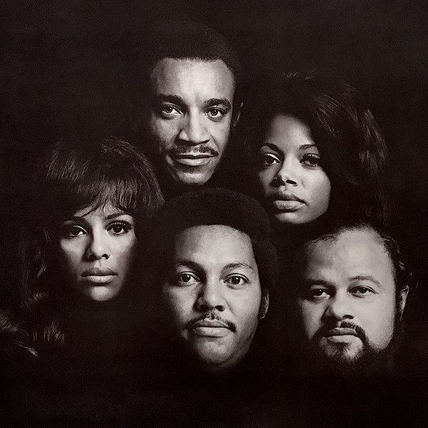

# The Fifth Dimension

## Artist Profile

Pop - soul vocal harmony group from USA.

Founded in the middle of the 60's by Billy Davis Jr. Their worldwide hit "Up-Up And Away" sold more than 5 million copies between 1967 and 1968 and its parent album more than 1 million copies during those years. 
In 1968 this group set a sensational record by winning 5 Grammy awards (Best song of the year for "Up-Up And Away", Best vocal group, Best contemporary album, Album of the year, Best contemporary group). 
They have recorded for Soul City (2), Liberty, Bell Records, ABC Records and Motown till the late 70's. The group changed its line-up many times over the years and was finally inducted into the Vocal Group Hall of Fame in 2002.

## Artist Links

- [http://www.classicbands.com/Fifth.html](http://www.classicbands.com/Fifth.html)
- [http://en.wikipedia.org/wiki/The_5th_Dimension](http://en.wikipedia.org/wiki/The_5th_Dimension)
- [http://www.whosampled.com/The-5th-Dimension/](http://www.whosampled.com/The-5th-Dimension/)

## See also

- [The Best Of The 5th Dimension](The_Best_Of_The_5th_Dimension.md)
