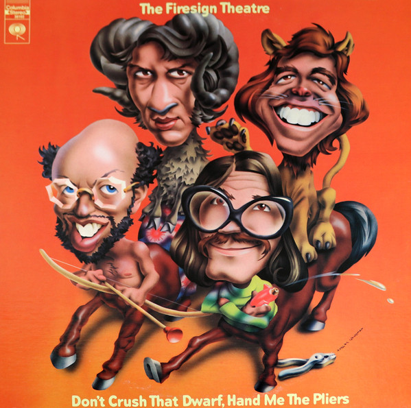

# Don't Crush That Dwarf, Hand Me The Pliers

By The Firesign Theatre

## Album Data

[Discogs URL](https://www.discogs.com/release/4952021-The-Firesign-Theatre-Dont-Crush-That-Dwarf-Hand-Me-The-Pliers)

- Label: Columbia
- Formats: Vinyl, LP, Album
- Genres: Non-Music, Comedy
- Rating: 3.6
- Released: null
- Year: 1970
- Release ID: 4952021
- Media condition: 
- Sleeve condition: 
- Speed: 
- Weight: 
- Notes: 

## Album Tracks

| **Position** | **Title** | **Duration** |
|--------------|-----------|--------------|
| A | **This Side** | 22:16 |
| B | **The Other Side** | 24:12 |

## Artist Roles

| **Name** | **Role** |
|----------|----------|
| **David Ossman** | Featuring |
| **Peter Bergman (2)** | Featuring |
| **Philip Austin** | Featuring |
| **Philip Proctor** | Featuring |

