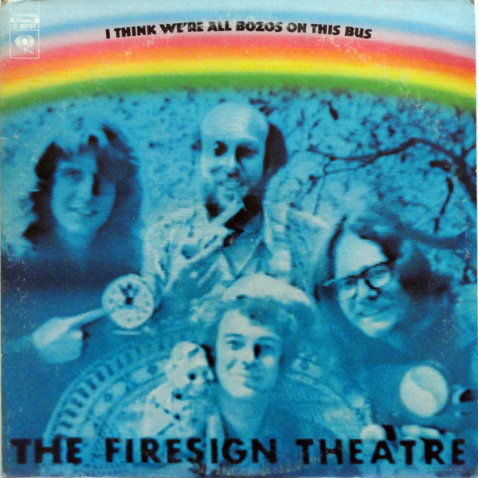

# I Think We're All Bozos On This Bus

By The Firesign Theatre

## Album Data

[Discogs URL](https://www.discogs.com/release/604696-The-Firesign-Theatre-I-Think-Were-All-Bozos-On-This-Bus)

- Label: Columbia
- Formats: Vinyl, LP, Album
- Genres: Non-Music, Comedy, Spoken Word
- Rating: 3.95
- Released: 1971
- Year: 1971
- Release ID: 604696
- Media condition: 
- Sleeve condition: 
- Speed: 
- Weight: 
- Notes: 

## Album Tracks

| **Position** | **Title** | **Duration** |
|--------------|-----------|--------------|
| A | **Side .001** | 20:55 |
| B | **Side .002** | 18:55 |

## Artist Roles

| **Name** | **Role** |
|----------|----------|
| **Bill Driml** | Engineer |
| **Phil Cross** | Engineer |
| **John Rose (7)** | Photography By |
| **David Ossman** | Written-By, Performer, Producer |
| **Peter Bergman (2)** | Written-By, Performer, Producer |
| **Philip Austin** | Written-By, Performer, Producer |
| **Philip Proctor** | Written-By, Performer, Producer |
| **The Firesign Theatre** | Written-By, Performer, Producer |

