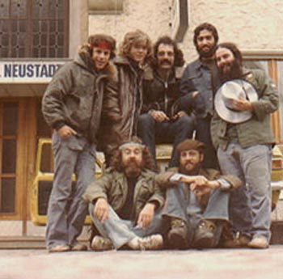

# The Flock

## Artist Profile

The Flock were an American Rock band from Chicago, formed in 1965 by Rick Canoff and Fred Glickstein.

Originally a Garage Rock band, their sound shifted towards Jazz-Rock / Fusion in the late 60s. After the release of their second album the band split in the early 70s.
A few years later The Flock reformed with a new lineup and went on a European tour in 1973. They released a third studio album in 1975, but split again shortly after.
2014 saw the release of a "lost" studio album comprised of material recorded in the mid to late 70s.

## Artist Links

- [https://en.wikipedia.org/wiki/The_Flock_%28band%29](https://en.wikipedia.org/wiki/The_Flock_%28band%29)
- [https://myspace.com/flock3](https://myspace.com/flock3)
- [http://www.progarchives.com/artist.asp?id=1119](http://www.progarchives.com/artist.asp?id=1119)

## See also

- [Dinosaur Swamps](Dinosaur_Swamps.md)
