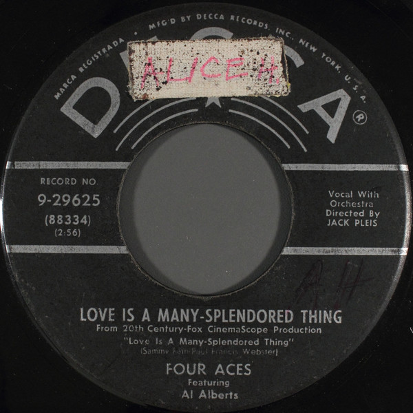

# Love Is A Many-Splendored Thing

By The Four Aces

## Album Data

[Discogs URL](https://www.discogs.com/release/7810961-The-Four-Aces-Featuring-Al-Alberts-Love-Is-A-Many-Splendored-Thing)

- Label: Decca
- Formats: Vinyl, 7", 45 RPM, Single
- Genres: Pop, Stage & Screen, Vocal
- Rating: 3
- Released: 1955
- Year: 1955
- Release ID: 7810961
- Media condition: 
- Sleeve condition: 
- Speed: 
- Weight: 
- Notes: 

## Album Tracks

| **Position** | **Title** | **Duration** |
|--------------|-----------|--------------|
| A | **Love Is A Many-Splendored Thing** | 2:56 |
| B | **Shine On Harvest Moon** | 2:27 |

## Artist Roles

| **Name** | **Role** |
|----------|----------|
| **Jack Pleis** | Directed By [Orchestra] |

