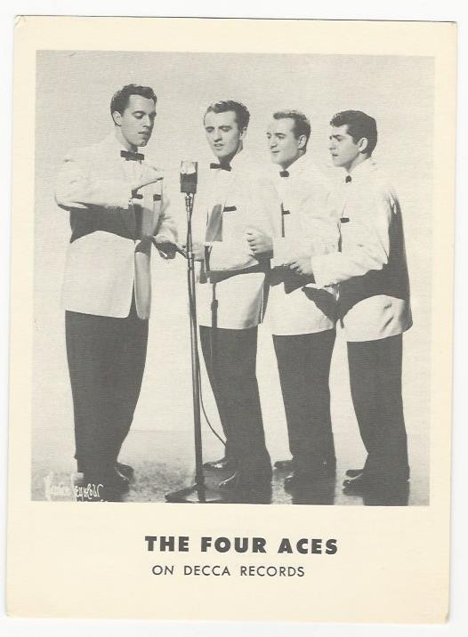

# The Four Aces

## Artist Profile

Al Alberts from South Philadelphia, who had worked with the big bands of Jan Savitt and Elliot Lawrence before World War II, played piano when he could get near one, and sang in a powerful tenor. His newfound friend Dave Mahoney from Chester, a suburb of the city, played fine tenor sax and could also sang vocal parts. They promised each other they would work together at the end of the war and live from music.

Returning to Chester in 1956, Alberts and Mahoney enlisted the aid of record owner Marty Caruso who rounded up two more members: Rosario "Sod" Vaccaro, who sang baritone and played trumpet, and Louis Silvestri, drummer and bass voice. Silvestri belonged to a roller-skating club called 'The Aces', and the group took the name as their own. They rehearsed and polished old standards, versions of current pop tunes, and wrote some new material to play at local clubs and college dances.

Al Alberts left the Four Aces in 1958 and was replaced by Freddie Diodatti. Eventually, all the original members left the group and a new line-up was formed, consisting of Tony Alesi, Joe Giglio and Harry Heisler. In 1975, the declining health of Tony Alesi forced him to leave the band. He was replaced by Danny Colingo.

After a legal battle between the original and new members of the formation, the court allowed the founding members to tour as "The Original Four Aces Featuring Al Alberts", which they did, finally retiring the original act in 1987. The second incarnation of The Four Aces still use the name and perform the songs that made The Original Four Aces popular. The group was intronized to the Vocal Group Hall of Fame in 2001.

## Artist Links

- [http://www.thefouraces.org/](http://www.thefouraces.org/)
- [http://en.wikipedia.org/wiki/The_Four_Aces](http://en.wikipedia.org/wiki/The_Four_Aces)

## See also

- [Love Is A Many-Splendored Thing](Love_Is_A_Many-Splendored_Thing.md)
- [Three Coins In The Fountain](Three_Coins_In_The_Fountain.md)
