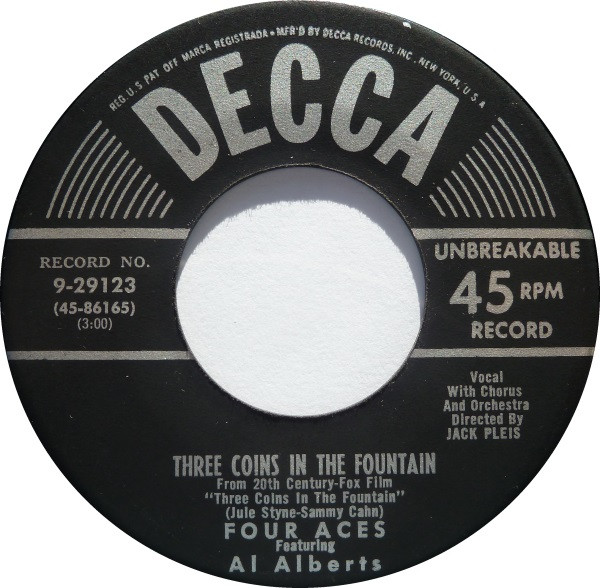

# Three Coins In The Fountain

By The Four Aces

## Album Data

[Discogs URL](https://www.discogs.com/release/5235793-Four-Aces-Three-Coins-In-The-Fountain)

- Label: Decca
- Formats: Vinyl, 7", 45 RPM
- Genres: Pop, Stage & Screen, Theme, Vocal
- Rating: 3.67
- Released: 1954
- Year: 1954
- Release ID: 5235793
- Media condition: 
- Sleeve condition: 
- Speed: 
- Weight: 
- Notes: 

## Album Tracks

| **Position** | **Title** | **Duration** |
|--------------|-----------|--------------|
| A | **Three Coins In The Fountain** | 3:00 |
| B | **Wedding Bells (Are Breaking Up That Old Gang Of Mine)** | 2:20 |

## Artist Roles

| **Name** | **Role** |
|----------|----------|
| **Jack Pleis** | Directed By [Chorus And Orchestra] |
| **Al Alberts** | Featuring |

