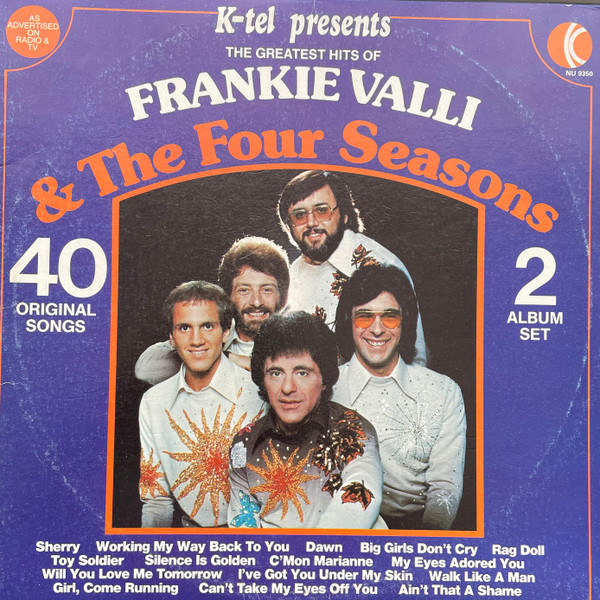

# The Greatest Hits Of Frankie Valli & The Four Seasons

By The Four Seasons

## Album Data

[Discogs URL](https://www.discogs.com/release/3929409-Frankie-Valli-The-Four-Seasons-The-Greatest-Hits-Of-Frankie-Valli-The-Four-Seasons)

- Label: K-Tel
- Formats: Vinyl, LP, Compilation
- Genres: Rock, Pop, Vocal
- Rating: 3.86
- Released: 1977
- Year: 1976
- Release ID: 3929409
- Media condition: 
- Sleeve condition: 
- Speed: 
- Weight: 
- Notes: 

## Album Tracks

| **Position** | **Title** | **Duration** |
|--------------|-----------|--------------|
| A1 | **Opus 17 (Don't Worry 'Bout Me)** |  |
| A2 | **Big Girls Don't Cry** |  |
| A3 | **Dawn** |  |
| A4 | **Silence Is Golden** |  |
| A5 | **Toy Soldiers** |  |
| A6 | **Will You Love Me Tomorrow** |  |
| A7 | **Don't Think Twice (It's All Right)** |  |
| A8 | **Too Many Memories** |  |
| A9 | **I've Got You Under My Skin** |  |
| A10 | **Sherry** |  |
| B1 | **Swearin' To God** |  |
| B2 | **Rag Doll** |  |
| B3 | **Walk Like A Man** |  |
| B4 | **Workin' My Way Back To You** |  |
| B5 | **Girl, Come Running** |  |
| B6 | **Bye-Bye, Baby (Baby, Goodbye)** |  |
| B7 | **Alone** |  |
| B8 | **(You're Gonna) Hurt Yourself** |  |
| B9 | **Save It For Me** |  |
| B10 | **Ronnie** |  |
| C1 | **My Eyes Adored You** |  |
| C2 | **Big Man In Town** |  |
| C3 | **Can't Take My Eyes Off You** |  |
| C4 | **Ain't That A Shame** |  |
| C5 | **And That Reminds Me** |  |
| C6 | **Huggin' My Pillow** |  |
| C7 | **Watch The Flowers Grow** |  |
| C8 | **A Patch Of Blue** |  |
| C9 | **Marlena** |  |
| C10 | **Let's Hang On** |  |
| D1 | **Fallen Angel** |  |
| D2 | **Tell It To The Rain** |  |
| D3 | **Connie-O** |  |
| D4 | **Candy Girl** |  |
| D5 | **C'Mon Marianne** |  |
| D6 | **Beggin'** |  |
| D7 | **The Proud One** |  |
| D8 | **To Give (The Reason I Live)** |  |
| D9 | **The Sun Ain't Gonna Shine Anymore** |  |
| D10 | **Stay** |  |

## Artist Roles

| **Name** | **Role** |
|----------|----------|
| **Bill Hicks (5)** | Design [Jacket] |

