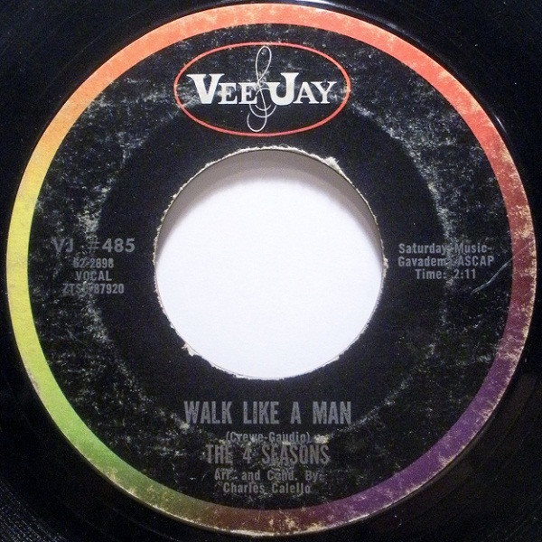

# Walk Like A Man

By The Four Seasons

## Album Data

[Discogs URL](https://www.discogs.com/release/5890782-The-4-Seasons-Walk-Like-A-Man)

- Label: Vee Jay Records
- Formats: Vinyl, 7", 45 RPM, Single
- Genres: Rock, Pop, Pop Rock, Doo Wop
- Rating: 3
- Released: 1963
- Year: 1963
- Release ID: 5890782
- Media condition: 
- Sleeve condition: 
- Speed: 
- Weight: 
- Notes: 

## Album Tracks

| **Position** | **Title** | **Duration** |
|--------------|-----------|--------------|
| A | **Walk Like A Man** | 2:11 |
| B | **Lucky Ladybug** | 2:41 |

## Artist Roles

| **Name** | **Role** |
|----------|----------|
| **Charlie Calello** | Arranged By, Conductor |
| **Bob Crewe** | Producer |

