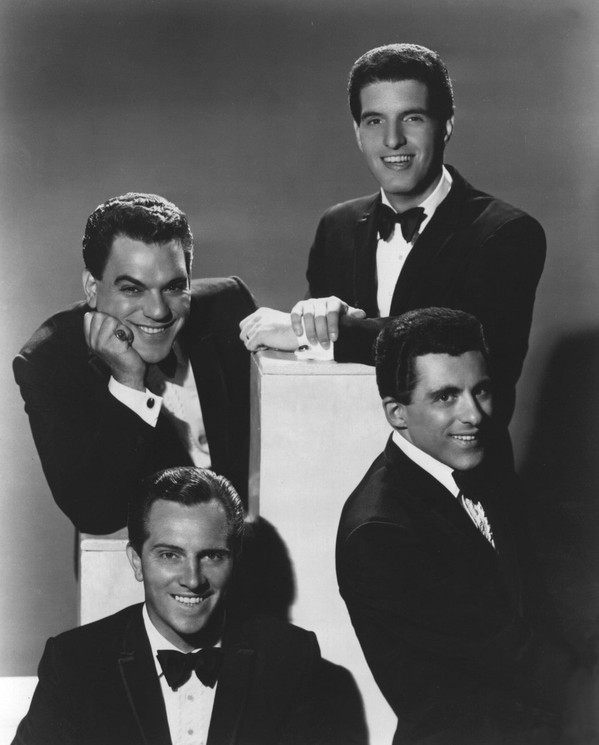

# The Four Seasons

## Artist Profile

1960's American vocal pop group from New Jersey.
Inducted into Rock And Roll Hall of Fame in 1990 (Performer). 
Still actively performing. 

## Artist Links

- [http://gilgweb.com/](http://gilgweb.com/)
- [http://en.wikipedia.org/wiki/The_Four_Seasons_(group)](http://en.wikipedia.org/wiki/The_Four_Seasons_(group))
- [https://www.imdb.com/name/nm1797921/](https://www.imdb.com/name/nm1797921/)

## See also

- [The Greatest Hits Of Frankie Valli & The Four Seasons](The_Greatest_Hits_Of_Frankie_Valli_and_The_Four_Seasons.md)
- [Walk Like A Man](Walk_Like_A_Man.md)
