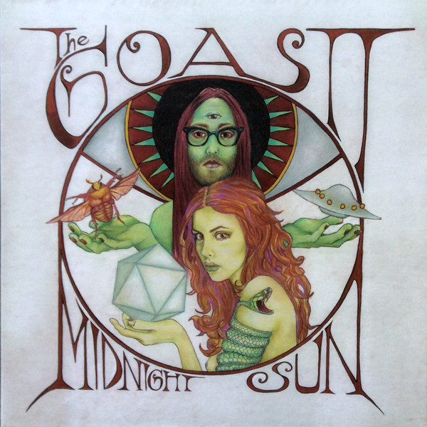

# Midnight Sun

By The Ghost Of A Saber Tooth Tiger

## Album Data

[Discogs URL](https://www.discogs.com/release/5603478-The-Goastt-Midnight-Sun)

- Label: Chimera Music
- Formats: Vinyl, LP, Album
- Genres: Rock, Folk, World, & Country, Psychedelic Rock
- Rating: 4.05
- Released: 2014-04-28
- Year: 2014
- Release ID: 5603478
- Media condition: 
- Sleeve condition: 
- Speed: 
- Weight: 
- Notes: 

## Album Tracks

| **Position** | **Title** | **Duration** |
|--------------|-----------|--------------|
| A1 | **Too Deep** |  |
| A2 | **Xanadu** |  |
| A3 | **Animals** |  |
| A4 | **Johannesburg** |  |
| A5 | **Midnight Sun** |  |
| A6 | **Last Call** |  |
| B1 | **The Devil You Know** |  |
| B2 | **Golden Earrings** |  |
| B3 | **Great Expectations** |  |
| B4 | **Poor Paul Getty** |  |
| B5 | **Don't Look Back Orpheus** |  |
| B6 | **Moth To A Flame** |  |

