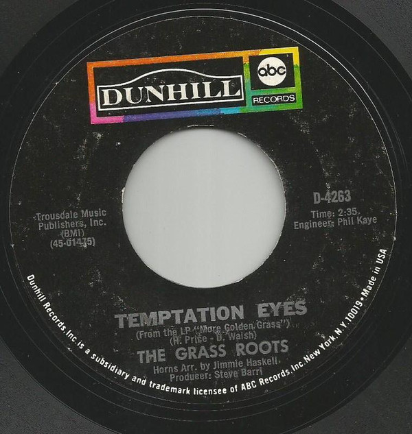

# Temptation Eyes

By The Grass Roots

## Album Data

[Discogs URL](https://www.discogs.com/release/7800199-The-Grass-Roots-Temptation-Eyes)

- Label: ABC/Dunhill Records
- Formats: Vinyl, 7", 45 RPM, Single, Styrene, Mono
- Genres: Rock, Classic Rock
- Rating: 4
- Released: 1970-12-00
- Year: 1970
- Release ID: 7800199
- Media condition: 
- Sleeve condition: 
- Speed: 
- Weight: 
- Notes: 

## Album Tracks

| **Position** | **Title** | **Duration** |
|--------------|-----------|--------------|
| A | **Temptation Eyes** | 2:35 |
| B | **Keepin' Me Down** | 4:52 |

## Artist Roles

| **Name** | **Role** |
|----------|----------|
| **Phil Kaye** | Engineer |
| **Steve Barri** | Producer |

