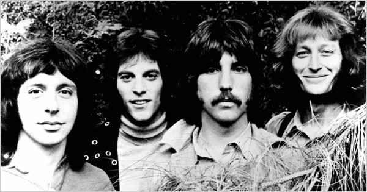

# The Grass Roots

## Artist Profile

US American rock band, formed 1966.
The band was originally the creation of Lou Adler and songwriting duo P.F. Sloan and Steve Barri. In their career, they achieved two gold albums, one gold single and charted singles on the Billboard Hot 100 a total of 21 times.

## Artist Links

- [http://the-grassroots.com/](http://the-grassroots.com/)
- [https://en.wikipedia.org/wiki/The_Grass_Roots](https://en.wikipedia.org/wiki/The_Grass_Roots)
- [https://www.imdb.com/name/nm1755725/](https://www.imdb.com/name/nm1755725/)

## See also

- [Let's Live For Today](Lets_Live_For_Today.md)
- [Temptation Eyes](Temptation_Eyes.md)
