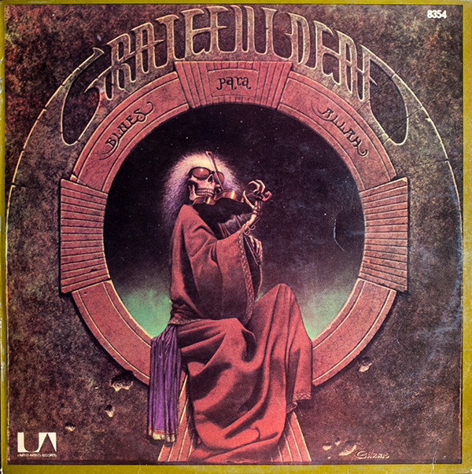

# Blues For Allah

By The Grateful Dead

## Album Data

[Discogs URL](https://www.discogs.com/release/1662275-Grateful-Dead-Blues-For-Allah)

- Label: Grateful Dead Records
- Formats: Vinyl, LP, Album
- Genres: Rock, Blues Rock, Folk Rock, Psychedelic Rock
- Rating: 4.13
- Released: 1975-09-01
- Year: 1975
- Release ID: 1662275
- Media condition: 
- Sleeve condition: 
- Speed: 
- Weight: 
- Notes: 

## Album Tracks

| **Position** | **Title** | **Duration** |
|--------------|-----------|--------------|
| A1a | **Help On The Way** | 3:15 |
| A1b | **Slipknot!** | 4:03 |
| A2 | **Franklin's Tower (Roll Away The Dew)** | 4:37 |
| A3a | **King Solomon's Marbles** | 1:55 |
| A3b | **Stronger Than Dirt Or Milkin' The Turkey** | 3:25 |
| A4 | **The Music Never Stopped** | 4:35 |
| B1 | **Crazy Fingers** | 6:41 |
| B2 | **Sage & Spirit** | 3:07 |
| B3a | **Blues For Allah** | 3:21 |
| B3b | **Sand Castles & Glass Camels** | 5:26 |
| B3c | **Unusual Occurances In The Desert** | 3:48 |

## Artist Roles

| **Name** | **Role** |
|----------|----------|
| **Phil Lesh** | Bass, Vocals |
| **Bill Kreutzmann** | Drums, Percussion |
| **Robbie Taylor (3)** | Engineer [Assistant] |
| **Dan Healy** | Engineer, Mixed By |
| **Bob Weir** | Guitar, Vocals |
| **Jerry Garcia** | Guitar, Vocals |
| **Keith Godchaux** | Keyboards, Vocals |
| **Robert Hunter** | Lyrics By |
| **Philip Garris** | Painting [Cover] |
| **Mickey Hart** | Percussion, Effects [Crickets] |
| **The Grateful Dead** | Producer, Mixed By |
| **Steve Schuster** | Reeds, Flute |
| **Betty Cantor** | Technician [Production Assistant] |
| **Bob Matthews** | Technician [Production Assistant] |
| **Brett Cohen** | Technician [Production Assistant] |
| **Ram Rod** | Technician [Production Assistant] |
| **Steve Brown (12)** | Technician [Production Assistant] |
| **Donna Godchaux** | Vocals |

