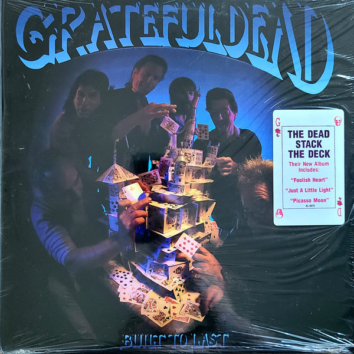

# Built To Last

By The Grateful Dead

## Album Data

[Discogs URL](https://www.discogs.com/release/6638806-Grateful-Dead-Built-To-Last)

- Label: Arista
- Formats: Vinyl, LP, Album
- Genres: Rock, Blues
- Rating: 4.15
- Released: 1989
- Year: 1989
- Release ID: 6638806
- Media condition: 
- Sleeve condition: 
- Speed: 
- Weight: 
- Notes: 

## Album Tracks

| **Position** | **Title** | **Duration** |
|--------------|-----------|--------------|
| A1 | **Foolish Heart** | 5:10 |
| A2 | **Just A Little Light** | 4:42 |
| A3 | **Victim Or The Crime** | 7:33 |
| A4 | **Standing On The Moon** | 5:20 |
| B1 | **Blow Away** | 6:09 |
| B2 | **Picasso Moon** | 6:40 |
| B3 | **Built To Last** | 5:03 |
| B4 | **I Will Take You Home** | 3:45 |

## Artist Roles

| **Name** | **Role** |
|----------|----------|
| **Alton Kelly** | Artwork, Cover, Art Direction |
| **Ken Perry** | Mastered By |
| **Jerry Garcia** | Producer |
| **John Culter** | Producer |

