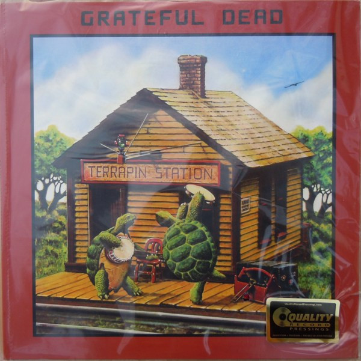

# Terrapin Station

By The Grateful Dead

## Album Data

[Discogs URL](https://www.discogs.com/release/3414495-Grateful-Dead-Terrapin-Station)

- Label: Analogue Productions
- Formats: Vinyl, LP, Album, Reissue
- Genres: Rock, Blues Rock, Country Rock, Folk Rock, Psychedelic Rock
- Rating: 4.76
- Released: 2012-02-10
- Year: 1977
- Release ID: 3414495
- Media condition: 
- Sleeve condition: 
- Speed: 
- Weight: 
- Notes: 

## Album Tracks

| **Position** | **Title** | **Duration** |
|--------------|-----------|--------------|
| A1 | **Estimated Prophet** | 5:35 |
| A2 | **Dancin' In The Streets** | 3:30 |
| A3 | **Passenger** | 2:48 |
| A4 | **Samson & Delilah** | 3:30 |
| A5 | **Sunrise** | 4:05 |
|  | **Terrapin Station** |  |
|  | **Terrapin Part I** | 16:10 |

## Artist Roles

| **Name** | **Role** |
|----------|----------|
| **Kevin Gray** | Lacquer Cut By |
| **Bill Kreutzmann** | Performer |
| **Bob Weir** | Performer |
| **Donna Godchaux** | Performer |
| **Jerry Garcia** | Performer |
| **Keith Godchaux** | Performer |
| **Mickey Hart** | Performer |
| **Phil Lesh** | Performer |
| **Keith Olsen** | Producer |

