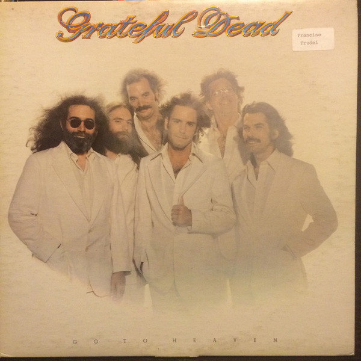

# Go To Heaven

By The Grateful Dead

## Album Data

[Discogs URL](https://www.discogs.com/release/1611604-Grateful-Dead-Go-To-Heaven)

- Label: Arista
- Formats: Vinyl, LP, Album
- Genres: Rock, Blues Rock, Folk Rock
- Rating: 3.81
- Released: 1980
- Year: 1980
- Release ID: 1611604
- Media condition: 
- Sleeve condition: 
- Speed: 
- Weight: 
- Notes: 

## Album Tracks

| **Position** | **Title** | **Duration** |
|--------------|-----------|--------------|
| A1 | **Alabama Getaway** | 3:36 |
| A2 | **Far From Me** | 3:40 |
| A3 | **Althea** | 6:51 |
| A4 | **Feel Like A Stranger** | 5:07 |
| B1 | **Lost Sailor** | 5:54 |
| B2 | **Saint Of Circumstance** | 5:40 |
| B3 | **Antwerp's Placebo (The Plumber)** | 0:38 |
| B4 | **Easy To Love You** | 3:40 |
| B5 | **Don't Ease Me In** | 3:13 |

## Artist Roles

| **Name** | **Role** |
|----------|----------|
| **Jim Welch (4)** | Art Direction [Art Direction & Production] |
| **Stanley Mouse** | Art Direction [Art Direction & Production] |
| **Alan Trist** | Coordinator, Directed By [Direction By] |
| **Richard Loren** | Coordinator, Directed By [Direction By] |
| **Rock Scully** | Coordinator, Directed By [Direction By] |
| **Betty Cantor-Jackson** | Engineer |
| **Bob Matthews** | Engineer [Additional Engineering] |
| **John Cutler** | Engineer [Additional Engineering] |
| **Pete Thea** | Engineer [Additional Engineering] |
| **Stanley Mouse** | Illustration |
| **George Marino** | Mastered By |
| **Bill Kreutzmann** | Musician [Grateful Dead] |
| **Bob Weir** | Musician [Grateful Dead] |
| **Brent Mydland** | Musician [Grateful Dead] |
| **Jerry Garcia** | Musician [Grateful Dead] |
| **Mickey Hart** | Musician [Grateful Dead] |
| **Phil Lesh** | Musician [Grateful Dead] |
| **Bob Seidemann** | Photography By |
| **Gary Lyons** | Producer, Engineer |

