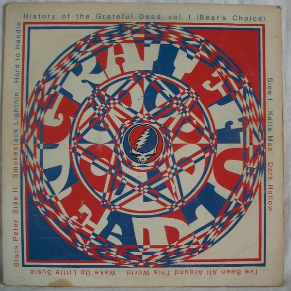

# History Of The Grateful Dead, Vol. 1 (Bear's Choice)

By The Grateful Dead

## Album Data

[Discogs URL](https://www.discogs.com/release/1893762-Grateful-Dead-History-Of-The-Grateful-Dead-Vol-1-Bears-Choice)

- Label: Warner Bros. Records
- Formats: Vinyl, LP, Album
- Genres: Rock, Blues Rock, Acoustic, Psychedelic Rock
- Rating: 4.28
- Released: 1973
- Year: 1973
- Release ID: 1893762
- Media condition: 
- Sleeve condition: 
- Speed: 
- Weight: 
- Notes: 

## Album Tracks

| **Position** | **Title** | **Duration** |
|--------------|-----------|--------------|
| A1 | **Katie Mae** | 4:46 |
| A2 | **Dark Hollow** | 3:30 |
| A3 | **I've Been All Around This World** | 4:40 |
| A4 | **Wake Up Little Susie** | 2:40 |
| A5 | **Black Peter** | 7:20 |
| B1 | **Smokestack Lightnin** | 18:00 |
| B2 | **Hard To Handle** | 6:14 |

## Artist Roles

| **Name** | **Role** |
|----------|----------|
| **Owsley Stanley** | Producer |
| **Bear (6)** | Recorded By |

