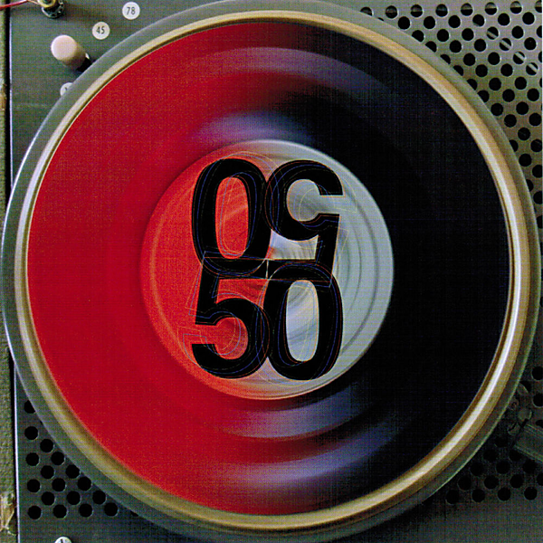

# P.N.E. Garden Aud., Vancouver, Canada, July 29 1966

By The Grateful Dead

## Album Data

[Discogs URL](https://www.discogs.com/release/10174824-Grateful-Dead-PNE-Garden-Aud-Vancouver-Canada-July-29-1966)

- Label: Rhino Records (2)
- Formats: Vinyl, LP, Limited Edition
- Genres: Rock, Country Rock, Psychedelic Rock, Classic Rock
- Rating: 4.6
- Released: 2017-04-22
- Year: 2017
- Release ID: 10174824
- Media condition: 
- Sleeve condition: 
- Speed: 
- Weight: 
- Notes: 

## Album Tracks

| **Position** | **Title** | **Duration** |
|--------------|-----------|--------------|
|  | **7/29/1966** |  |
| A1 | **Standing On The Corner** | 3:23 |
| A2 | **I Know You Rider** | 3:14 |
| A3 | **Next Time You See Me** | 3:37 |
| A4 | **Sittin' On Top Of The World** | 3:47 |
| A5 | **You Don't Have To Ask** | 5:14 |
| B1 | **Big Boss Man** | 4:16 |
| B2 | **Stealin'** | 3:37 |
| B3 | **Cardboard Cowboy** | 2:56 |
| B4 | **It's All Over Now, Baby Blue** | 5:23 |
| B5 | **Cream Puff War** | 7:52 |
| C1 | **Viola Lee Blues** | 10:03 |
| C2 | **Beat It On Down The Line** | 2:47 |
| C3 | **Good Mornin' Little Schoolgirl** | 5:47 |
|  | **7/30/1966** |  |
| D1 | **Cold Rain And Snow** | 3:14 |
| D2 | **One Kind Favor** | 4:23 |
| D3 | **Hey Little One** | 5:39 |
| D4 | **New, New Minglewood Blues** | 3:23 |

## Artist Roles

| **Name** | **Role** |
|----------|----------|
| **Steve Vance** | Art Direction, Design |
| **Doran Tyson** | Co-producer [Associate Producer] |
| **Ivette Ramos** | Co-producer [Associate Producer] |
| **Bob Masse** | Cover |
| **Mark Pinkus** | Executive-Producer |
| **Chris Bellman** | Lacquer Cut By |
| **Jeffrey Norman** | Mastered By |
| **The Grateful Dead** | Producer |
| **David Lemieux (2)** | Producer [For Release] |
| **Owsley Stanley** | Recorded By |
| **Michael Wesley Johnson** | Research [Tape Research] |

