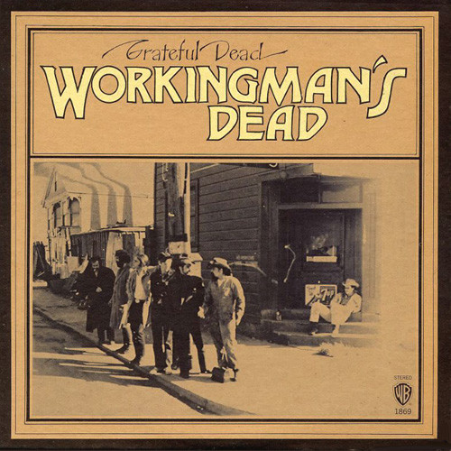

# Workingman's Dead

By The Grateful Dead

## Album Data

[Discogs URL](https://www.discogs.com/release/774120-The-Grateful-Dead-Workingmans-Dead)

- Label: Warner Bros. Records
Warner Bros. Records
- Formats: Vinyl, LP, Album, Stereo
- Genres: Rock, Folk Rock, Country Rock, Classic Rock
- Rating: 4.49
- Released: 1970-06-14
- Year: 1970
- Release ID: 774120
- Media condition: 
- Sleeve condition: 
- Speed: 
- Weight: 
- Notes: 

## Album Tracks

| **Position** | **Title** | **Duration** |
|--------------|-----------|--------------|
| A1 | **Uncle John's Band** | 4:42 |
| A2 | **High Time** | 5:13 |
| A3 | **Dire Wolf** | 3:13 |
| A4 | **New Speedway Boogie** | 4:05 |
| B1 | **Cumberland Blues** | 3:15 |
| B2 | **Black Peter** | 5:42 |
| B3 | **Easy Wind** | 4:59 |
| B4 | **Casey Jones** | 4:24 |

## Artist Roles

| **Name** | **Role** |
|----------|----------|
| **Bonnie Parker (3)** | Administrator [Guardians of the Vault] |
| **David Parker (12)** | Administrator [Guardians of the Vault] |
| **Cosmic Gail** | Administrator [Lady in Waiting] |
| **Ram Rod** | Crew [Equipment] |
| **Rex Jackson** | Crew [Equipment] |
| **Sonny Heard** | Crew [Equipment] |
| **Alembic** | Engineer [Engineered By] |
| **Kent Duncan** | Lacquer Cut By |
| **Robert Hunter** | Lyrics By |
| **John McIntire** | Management [Big Nurse] |
| **Sam Cutler** | Management [Executive Nanny] |
| **Jerry Garcia** | Music By |
| **Phil Lesh** | Music By |
| **Mouse Studios** | Photography By [Cover Photo], Artwork, Design |
| **Toon N Tree** | Photography By [Cover Photo], Artwork, Design |
| **Betty Cantor** | Producer |
| **Bob Matthews** | Producer |
| **The Grateful Dead** | Producer |

