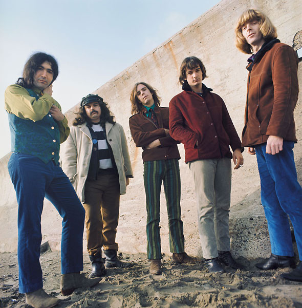

# The Grateful Dead

## Artist Profile

Grateful Dead was an American rock band (1965–1995) formed in the San Francisco Bay Area. Initially formed in 1964 as The Warlocks (4).

## Artist Links

- [https://www.dead.net/](https://www.dead.net/)
- [https://www.vinylworld.org/grateful-dead/](https://www.vinylworld.org/grateful-dead/)
- [http://www.deaddisc.com/](http://www.deaddisc.com/)
- [https://en.wikipedia.org/wiki/Grateful_Dead](https://en.wikipedia.org/wiki/Grateful_Dead)
- [https://www.imdb.com/name/nm0335993/](https://www.imdb.com/name/nm0335993/)
- [https://www.facebook.com/gratefuldead/](https://www.facebook.com/gratefuldead/)
- [https://twitter.com/gratefuldead](https://twitter.com/gratefuldead)
- [https://www.youtube.com/user/gratefuldead](https://www.youtube.com/user/gratefuldead)
- [http://tcgdd.freeyellow.com/tcgdd.txt](http://tcgdd.freeyellow.com/tcgdd.txt)
- [https://www.whosampled.com/Grateful-Dead/](https://www.whosampled.com/Grateful-Dead/)

## See also

- [Blues For Allah](Blues_For_Allah.md)
- [Built To Last](Built_To_Last.md)
- [Go To Heaven](Go_To_Heaven.md)
- [History Of The Grateful Dead, Vol. 1 (Bear's Choice)](History_Of_The_Grateful_Dead__Vol_1_Bears_Choice.md)
- [P.N.E. Garden Aud., Vancouver, Canada, July 29 1966](PNE_Garden_Aud__Vancouver__Canada__July_29_1966.md)
- [Terrapin Station](Terrapin_Station.md)
- [Workingman's Dead](Workingmans_Dead.md)
