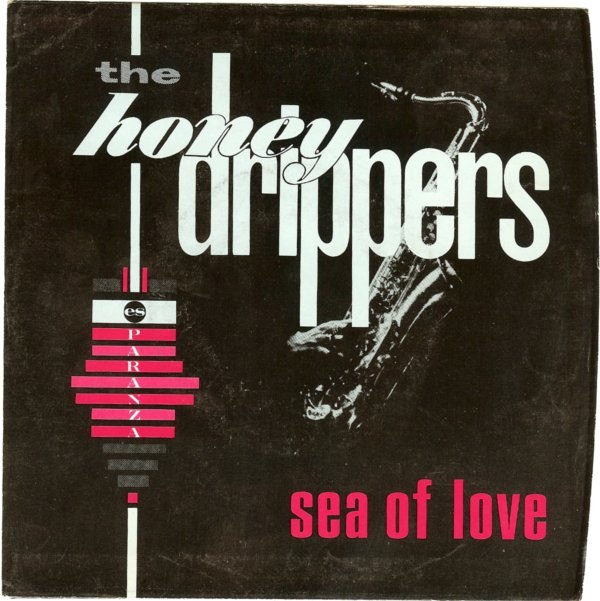

# Sea Of Love / Rockin' At Midnight

By The Honeydrippers

## Album Data

[Discogs URL](https://www.discogs.com/release/2143445-The-Honeydrippers-Sea-Of-Love-Rockin-At-Midnight)

- Label: Es Paranza Records
- Formats: Vinyl, 7", 45 RPM, Single
- Genres: Rock, Blues, Pop, Rock & Roll
- Rating: 4.13
- Released: 1984-09-00
- Year: 1984
- Release ID: 2143445
- Media condition: 
- Sleeve condition: 
- Speed: 
- Weight: 
- Notes: 

## Album Tracks

| **Position** | **Title** | **Duration** |
|--------------|-----------|--------------|
| A | **Sea Of Love** | 3:02 |
| B | **Rockin' At Midnight** | 5:57 |

## Artist Roles

| **Name** | **Role** |
|----------|----------|
| **Dennis King** | Lacquer Cut By |
| **Nugetre** | Producer |
| **The Fabulous Brill Brothers** | Producer |

