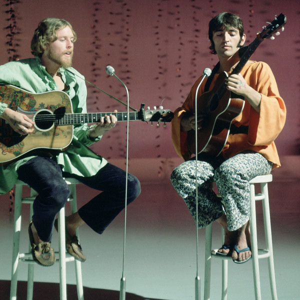

# The Incredible String Band

## Artist Profile

Scottish psychedelic folk band from Edinburgh / Glasgow, founded in 1966.

## Artist Links

- [http://en.wikipedia.org/wiki/Incredible_String_Band](http://en.wikipedia.org/wiki/Incredible_String_Band)
- [http://www.users.waitrose.com/~gimbri/live_and_unreleased.html](http://www.users.waitrose.com/~gimbri/live_and_unreleased.html)
- [http://www.makingtime.co.uk/beglad/index1.htm](http://www.makingtime.co.uk/beglad/index1.htm)
- [http://www.myspace.com/theincrediblestringband](http://www.myspace.com/theincrediblestringband)

## See also

- [Wee Tam](Wee_Tam.md)
