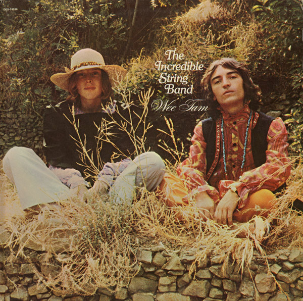

# Wee Tam

By The Incredible String Band

## Album Data

[Discogs URL](https://www.discogs.com/release/1535681-The-Incredible-String-Band-Wee-Tam)

- Label: Elektra
- Formats: Vinyl, LP, Album, Stereo
- Genres: Rock, Folk, World, & Country, Folk Rock, Folk
- Rating: 4.03
- Released: 1969
- Year: 1968
- Release ID: 1535681
- Media condition: 
- Sleeve condition: 
- Speed: 
- Weight: 
- Notes: 

## Album Tracks

| **Position** | **Title** | **Duration** |
|--------------|-----------|--------------|
| A1 | **Job's Tears** | 6:40 |
| A2 | **Puppies** | 5:30 |
| A3 | **Beyond The See** | 2:16 |
| A4 | **The Yellow Snake** | 2:04 |
| A5 | **Log Cabin Home In The Sky** | 4:00 |
| B1 | **You Get Brighter** | 5:44 |
| B2 | **The Half-Remarkable Question** | 5:01 |
| B3 | **Air** | 3:12 |
| B4 | **Ducks On A Pond** | 9:17 |

## Artist Roles

| **Name** | **Role** |
|----------|----------|
| **William S. Harvey** | Art Direction |
| **Elaine Gongora** | Design [Cover] |
| **John Wood** | Engineer |
| **Guy Webster** | Photography By |
| **Joe Boyd** | Producer |
| **Jac Holzman** | Supervised By [American Production Supervision] |
| **Mike Heron (2)** | Written-By |
| **Robin Williamson** | Written-By |

