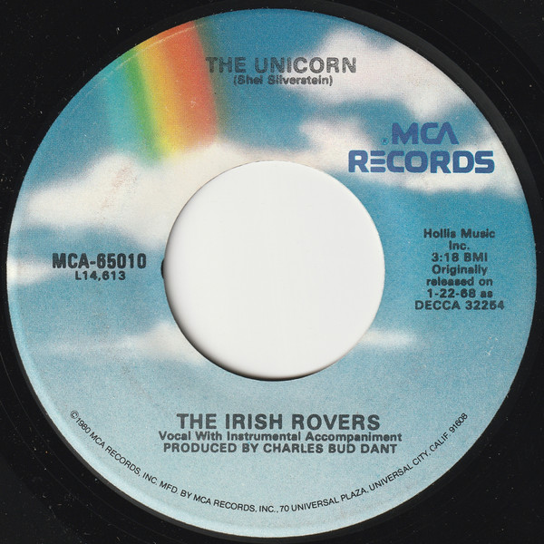

# The Unicorn / (The Puppet Song) Whiskey On A Sunday

By The Irish Rovers

## Album Data

[Discogs URL](https://www.discogs.com/release/2232932-The-Irish-Rovers-The-Unicorn-The-Puppet-Song-Whiskey-On-A-Sunday)

- Label: MCA Records
- Formats: Vinyl, 7", 45 RPM, Reissue
- Genres: Pop, Folk, World, & Country
- Rating: 3.8
- Released: 1984
- Year: 1973
- Release ID: 2232932
- Media condition: 
- Sleeve condition: 
- Speed: 
- Weight: 
- Notes: 

## Album Tracks

| **Position** | **Title** | **Duration** |
|--------------|-----------|--------------|
| A | **The Unicorn** | 3:18 |
| B | **(The Puppet Song) Whiskey On A Sunday** | 2:38 |

## Artist Roles

| **Name** | **Role** |
|----------|----------|
| **Charles "Bud" Dant** | Producer |

