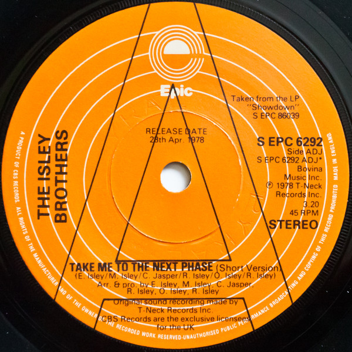

# Take Me To The Next Phase

By The Isley Brothers

## Album Data

[Discogs URL](https://www.discogs.com/release/648040-The-Isley-Brothers-Take-Me-To-The-Next-Phase)

- Label: T-Neck
- Formats: Vinyl, 7", 45 RPM
- Genres: Funk / Soul, Funk, Disco
- Rating: 4.15
- Released: 1978
- Year: 1978
- Release ID: 648040
- Media condition: 
- Sleeve condition: 
- Speed: 
- Weight: 
- Notes: 

## Album Tracks

| **Position** | **Title** | **Duration** |
|--------------|-----------|--------------|
| A | **Take Me To The Next Phase (Part 1)** | 4:12 |
| B | **Take Me To The Next Phase (Part 2)** | 3:20 |

## Artist Roles

| **Name** | **Role** |
|----------|----------|
| **The Isley Brothers** | Arranged By, Producer |
| **Chris Jasper** | Written-By |
| **Ernie Isley** | Written-By |
| **Marvin Isley** | Written-By |
| **O'Kelly Isley** | Written-By |
| **Ronald Isley** | Written-By |
| **Rudolph Isley** | Written-By |

