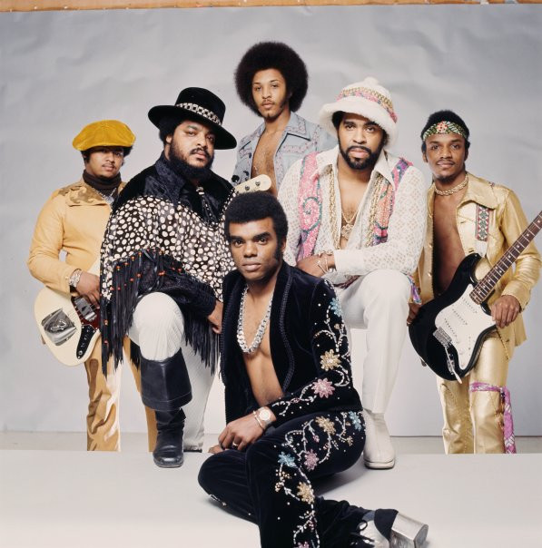

# The Isley Brothers

## Artist Profile

American R&B/soul group from Cincinnati, Ohio, established in the early 1950's. O’Kelly Isley, Rudolph Isley, Ronald Isley and Vernon Isley (died 1956 in automobile accident), comprised the original group. They released their early hit “Shout!,” in 1959. In 1963 they started own label T-Neck, and added a young Jimi Hendrix on lead guitar. In 1965 they signed on to Motown where they recorded “This Old Heart Of Mine." They left Motown in 1968 and re-launched the T-Neck label in 1969 when they released “It's Your Thing." In 1973 they added the younger brothers Ernie and Marvin Isley, as well as O’Kelly's brother-in-law Chris Jasper, to their regular lineup. During this era from 1973 to 1983 the group continued to release hits like “Between the Sheets," “Choosey Lover,” or “For the Love Of You."
Inducted into Rock And Roll Hall of Fame in 1992 (Performer).

## Artist Links

- [http://theisleybrothersofficial.com/](http://theisleybrothersofficial.com/)
- [https://theisleybrothers.bandcamp.com/](https://theisleybrothers.bandcamp.com/)
- [https://www.facebook.com/isleybrothers](https://www.facebook.com/isleybrothers)
- [https://www.imdb.com/name/nm1499438/](https://www.imdb.com/name/nm1499438/)
- [https://myspace.com/isleybrothers](https://myspace.com/isleybrothers)
- [https://www.whosampled.com/The-Isley-Brothers/](https://www.whosampled.com/The-Isley-Brothers/)
- [https://en.wikipedia.org/wiki/The_Isley_Brothers](https://en.wikipedia.org/wiki/The_Isley_Brothers)
- [https://www.youtube.com/user/TheIsleyBrothersVEVO](https://www.youtube.com/user/TheIsleyBrothersVEVO)

## See also

- [Take Me To The Next Phase](Take_Me_To_The_Next_Phase.md)
