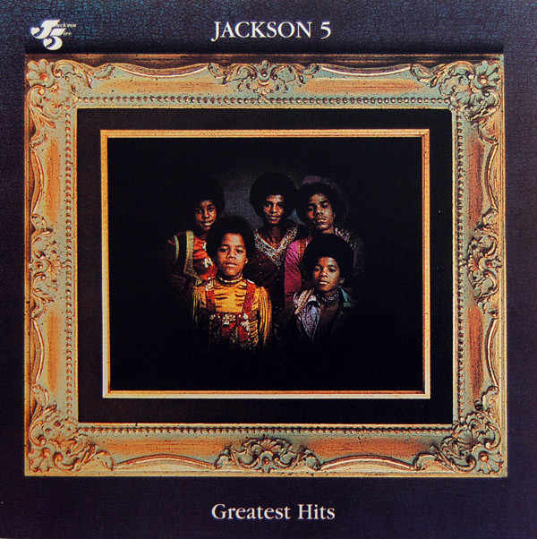

# Greatest Hits

By The Jackson 5

## Album Data

[Discogs URL](https://www.discogs.com/release/3577899-The-Jackson-5-Greatest-Hits)

- Label: Motown
Motown
- Formats: Vinyl, LP, Compilation
- Genres: Funk / Soul, Soul
- Rating: 4.5
- Released: 1971
- Year: 1971
- Release ID: 3577899
- Media condition: 
- Sleeve condition: 
- Speed: 
- Weight: 
- Notes: 

## Album Tracks

| **Position** | **Title** | **Duration** |
|--------------|-----------|--------------|
| A1 | **I Want You Back** | 2:58 |
| A2 | **ABC** | 2:38 |
| A3 | **Never Can Say Goodbye** | 2:56 |
| A4 | **Sugar Daddy** | 2:34 |
| A5 | **I'll Be There** | 3:35 |
| A6 | **Maybe Tomorrow** | 4:46 |
| B1 | **The Love You Save** | 2:42 |
| B2 | **Who's Lovin You** | 3:57 |
| B3 | **Mama's Pearl** | 3:11 |
| B4 | **Goin' Back To Indiana** | 3:30 |
| B5 | **I Found That Girl** | 2:42 |

