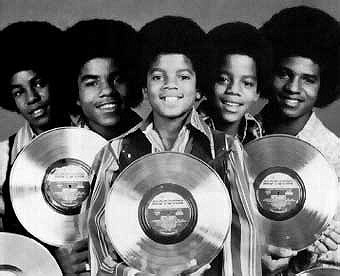

# The Jackson 5

## Artist Profile

The Jackson 5 were a group made up of five brothers from Gary, Indiana, USA, under the leadership of their father Joseph Jackson: Jackie, Tito, Jermaine, Marlon and Michael. 

Formally known as The Jackson 5, they later changed their name to The Jacksons when they switched labels from Motown to Epic, via Philadelphia International Records; Jermaine would stay behind at Motown while youngest brother Randy would join the group.

Inducted into Rock And Roll Hall of Fame in 1997 (Performer).

## Artist Links

- [https://thejacksons.live/](https://thejacksons.live/)
- [https://chicagoreader.com/music/the-jackson-find/](https://chicagoreader.com/music/the-jackson-find/)
- [https://en.wikipedia.org/wiki/The_Jackson_5](https://en.wikipedia.org/wiki/The_Jackson_5)
- [https://www.whosampled.com/The-Jackson-5/](https://www.whosampled.com/The-Jackson-5/)

## See also

- [Get It Together](Get_It_Together.md)
- [Greatest Hits](Greatest_Hits.md)
