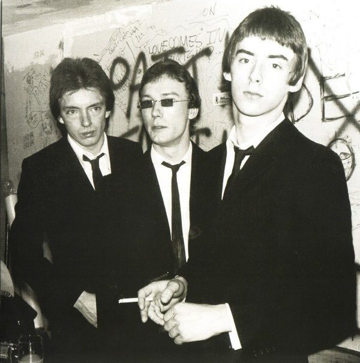

# The Jam

## Artist Profile

Mod/rock band formed in 1972 at Sheerwater Secondary School in Woking, England, by members Paul Weller (Lead Guitar, Vocals,) Rick Buckler (Drums & Percussion) and Bruce Foxton (Bass Guitar, Backing Vocals). Broke up in 1982.

## Artist Links

- [https://www.fromthejamofficial.com/](https://www.fromthejamofficial.com/)
- [https://en.wikipedia.org/wiki/The_Jam](https://en.wikipedia.org/wiki/The_Jam)
- [https://www.facebook.com/FromTheJam/](https://www.facebook.com/FromTheJam/)

## See also

- [Sound Affects](Sound_Affects.md)
