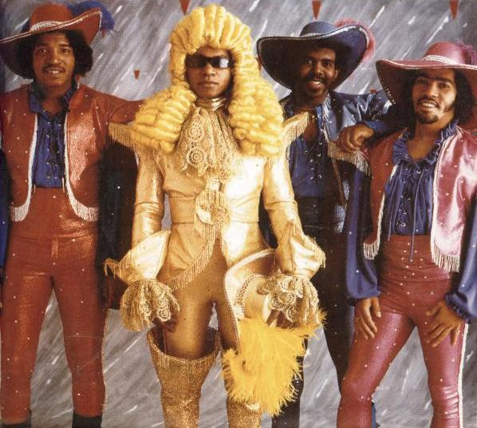

# The Jonzun Crew

## Artist Profile

Michael and Soni Johnson, who were born in Florida, formed the Jonzun Crew in Boston with Steve Thorpe and Gordy Worthy. They were a mix of electrofunk and rock beats and comic/ novelty lyrics and had sizable hits in 1982 and 1983 with "Pack Jam (Look out for the OVC)" and "We Are The Jonzun Crew". Michael Jonzun left the group in 1986 for a solo career, but didn't do much beyond one A&M release. He had more impact as the person who discovered New Edition and as the writer/ producer of their hit "Candy Girl".

## Artist Links

## See also

- [We Are The Jonzun Crew](We_Are_The_Jonzun_Crew.md)
