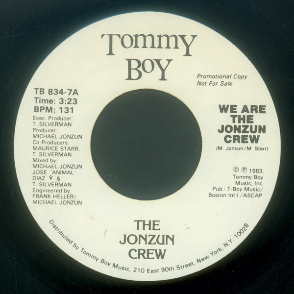

# We Are The Jonzun Crew

By The Jonzun Crew

## Album Data

[Discogs URL](https://www.discogs.com/release/2222052-The-Jonzun-Crew-We-Are-The-Jonzun-Crew)

- Label: Tommy Boy
- Formats: Vinyl, 7", 45 RPM, Promo
- Genres: Electronic, Hip Hop, Electro
- Rating: 5
- Released: 1983
- Year: 1983
- Release ID: 2222052
- Media condition: 
- Sleeve condition: 
- Speed: 
- Weight: 
- Notes: 

## Album Tracks

| **Position** | **Title** | **Duration** |
|--------------|-----------|--------------|
| A | **We Are The Jonzun Crew** | 3:23 |
| B | **Ground Control** | 5:40 |

## Artist Roles

| **Name** | **Role** |
|----------|----------|
| **Maurice Starr** | Co-producer |
| **Tom Silverman** | Co-producer |
| **Frank Heller** | Engineer |
| **Michael Jonzun** | Engineer |
| **Tom Silverman** | Executive-Producer |
| **Jose Animal Diaz** | Mixed By |
| **Michael Jonzun** | Mixed By |
| **Tom Silverman** | Mixed By |
| **Michael Jonzun** | Producer |
| **Maurice Starr** | Written-By |
| **Michael Jonzun** | Written-By |

